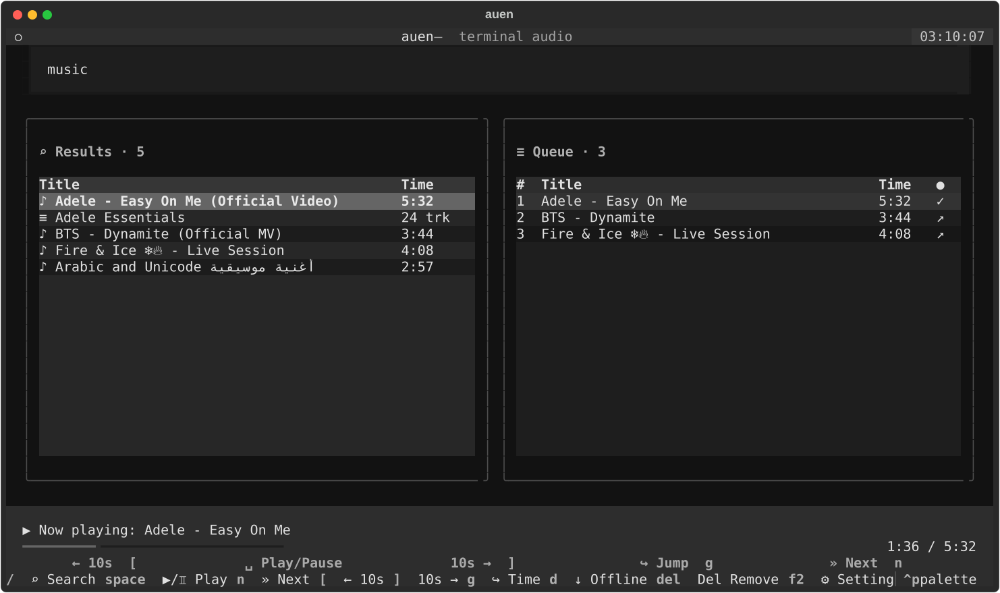
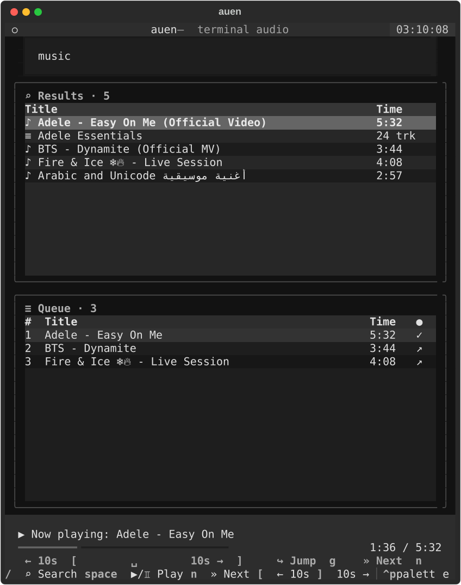

# auen

`auen` is a keyboard-first terminal audio player for Linux and Android/Termux. It uses a
full-screen Textual interface for YouTube search, queue management, streaming, and a
size-limited persistent playback cache.

> **Release — v0.5.0:** Core playback, responsive rendering, History, named playlists,
> Offline media, command mode, sleep timers, anonymous-request cooldown, and shutdown
> behavior have been exercised with `mpv` on Linux and a physical Termux device.



### Phone-width layout



## What works in v0.5.0

- Search YouTube and select tracks, albums, or playlists.
- Load more results explicitly without fetching merely by moving the cursor.
- Stream immediately or stream while retaining a managed offline copy.
- Play, pause, jump to a timestamp, seek by 10 seconds, and skip tracks with `mpv`.
- Add duplicate tracks with confirmation; play any queued row now or move its priority.
- Persist the queue, recently played tracks, cached media, settings, and playback position
  across restarts and crashes.
- Open Recently Played with `h`, including last-played timestamps and play counts; play now,
  play next, remove individual entries, or clear history with confirmation.
- Create, rename, delete, open, reorder, and play durable named playlists. Add tracks from
  search results, History, Queue, or another named playlist, or append a whole playlist to
  Queue in saved order.
- See streaming, downloading, and offline availability directly in Queue, History, and an
  opened named playlist.
- Open Offline media with `l`; filter locally without a network connection, inspect duration
  and size, play or queue cached tracks, retain or release automatic cache entries, delete
  managed media safely, and inspect cache usage and download activity.
- Pace anonymous YouTube operations across search, streaming, and downloads. A bot challenge
  or HTTP 429 starts a short fail-fast cooldown shown in the Offline strip, while cached and
  local playback remain available.
- Get compact, view-specific key guidance at the bottom of the focused Results or Queue pane.
- Preview and save themes, with an adaptive side-by-side or stacked phone-width layout.
- Configure behavior through the TUI or scriptable `auen config` commands.
- Open compact command mode with `:` for sleep timers, navigation, settings, themes, help,
  and clean quitting. Duration timers pause in place; `sleep track` holds the remaining Queue.

This is intentionally an early prototype. Local file and directory import is planned for a
later version. auen deliberately does not use Google-account cookies; videos
or networks that require authenticated YouTube access may therefore be unavailable. Request
pacing can reduce bursts, but it cannot bypass a YouTube IP or account challenge.

## Requirements

- Python 3.10 or newer
- Linux with `mpv`, or Android with Termux and its `mpv` package
- Network access for YouTube search and streaming

`pipx` is recommended on Linux because it keeps auen and its Python dependencies in an
isolated environment.

## Install on Linux

Install the system playback backend first. For Debian and Ubuntu:

```console
sudo apt install mpv pipx
pipx ensurepath
```

Install the tagged prototype directly from GitHub:

```console
pipx install 'git+https://github.com/razorvel/auen.git@v0.5.0'
auen doctor
auen
```

For a checked-out source tree, use `pipx install .`. A regular virtual environment also
works:

```console
python3 -m venv .venv
. .venv/bin/activate
python -m pip install .
auen doctor
auen
```

## Prepare Termux for testing

Install [Termux](https://github.com/termux/termux-app#installation), then run:

```console
pkg update
pkg install python git mpv ffmpeg
python -m pip install 'git+https://github.com/razorvel/auen.git@v0.5.0'
auen doctor
auen
```

mpv is selected automatically and provides seeking, direct streaming, volume control, and
precise position reporting. Termux:API is not required when mpv is installed.

The real-device test sequence and expected limitations are recorded in
[`docs/termux-testing.md`](docs/termux-testing.md).

## Essential controls

| Key | Action |
| --- | --- |
| `/` | Focus search |
| `Tab` / `Shift+Tab` | Switch between Results and Queue |
| `Enter` | Open a collection, queue a result, or play a queued row now |
| `Esc` | Leave search or return from a collection |
| `Space` | Play or pause |
| `[` / `]` | Seek backward or forward 10 seconds |
| `g` | Jump to a timestamp |
| `n` | Play next track |
| `h` | Open or leave Recently Played |
| `p` | Open or leave named Playlists |
| `l` | Open or leave Offline media |
| `:` | Open command mode |
| `s` | Save the selected track to a named playlist |
| `e` | Append every track in the currently open named playlist to Queue |
| `d` | Retain the selected result for offline playback |
| `Home` | Promote the selected queued track to play next |
| `Shift+Up` / `Shift+Down` | Change queue priority |
| `Delete` | Remove the selected queued track |
| `F2` | Open Settings |
| `F3` | Preview and select a theme |
| `q` | Quit and stop playback |

In Recently Played, Enter plays the selected track now, Home places it next, `a` appends it
to Queue, Delete removes one entry, `c` clears all history after confirmation, and Escape
returns to the exact prior Results view.

In Playlists, `c` creates, `r` renames, Delete removes with confirmation, and Enter opens a
playlist. Inside one, Enter plays now, Home plays next, `a` appends to Queue,
`e` confirms and appends the entire playlist, Shift+Up/Down reorders, Delete removes a
track, and Escape returns to the playlist list.

Availability symbols are consistent across Queue, Recently Played, and opened playlists:
`✓` is available offline, `↓` is downloading, and `↗` will stream.

In Offline media, `◆` is explicitly retained and `○` is an automatic cache entry eligible
for size-based eviction. `/` focuses a title filter that works entirely from the local cache.
Enter plays now, Home plays next, `a` appends to Queue, `s` saves to a named playlist, `k`
switches between retained and bounded cache, Delete removes the managed media file after
confirmation, and Escape restores the prior Results view. Older cached entries show an
unknown duration until first playback; mpv then discovers and saves it locally.

Left and Right page through a long selected title. Leaving that row restores its title to
the beginning. Playback seeking deliberately uses `[` and `]`, so arrow keys remain safe
for tables and text fields.

### Command mode and sleep timers

Press `:` while Results or Queue is focused, type a command, and press Enter. Escape closes
the command field without running anything. Search continues to accept `:` as ordinary text.

| Command | Action |
| --- | --- |
| `sleep 30` | Pause playback in 30 minutes |
| `sleep 1h 20m` | Pause after a combined duration |
| `sleep 1:30` | Pause in 1 hour 30 minutes |
| `sleep at 23:30` | Pause at the next occurrence of that local time |
| `sleep track` | Finish the current track, then hold Queue playback |
| `sleep` | Show the active timer |
| `sleep cancel` | Cancel the active timer |
| `library`, `history`, `playlists` | Open that view |
| `settings`, `theme` | Open that screen |
| `help`, `quit` | Show command help or quit auen |

An active timer appears beside Now Playing. Duration timers pause the current track in place;
Space resumes it. After-track timers preserve the remaining Queue, and Space starts its next
track. Sleep timers intentionally do not survive quitting and restarting auen.

Some terminals disagree with Textual about the rendered width of shaped Indic scripts,
which can corrupt adjacent columns. auen transliterates only those script runs in table and
Now Playing display text; the original Unicode title remains unchanged in searches, saved
state, playlists, and playback metadata.

## Settings from the terminal

```console
auen config list
auen config get cache.max_size
auen config set cache.max_size 1.5GB
auen config set session.mode stream_and_cache
auen config set history.limit 500
auen config reset playback.volume
```

Preferences are stored in the platform configuration directory. Queue and recovery data
use a separate transactional SQLite database. Run `auen doctor` whenever installation or
backend setup is unclear.

## Develop and build

```console
python3 -m venv .venv
. .venv/bin/activate
python -m pip install -e '.[dev]'
make check
make build
```

`make check` runs the test suite with a safety timeout, linting, and strict type checking.
`make build` creates a wheel and source archive in `dist/`. The product baseline and
future requirements are in [`docs/requirements.md`](docs/requirements.md).

## License

auen is available under the [MIT License](LICENSE).
